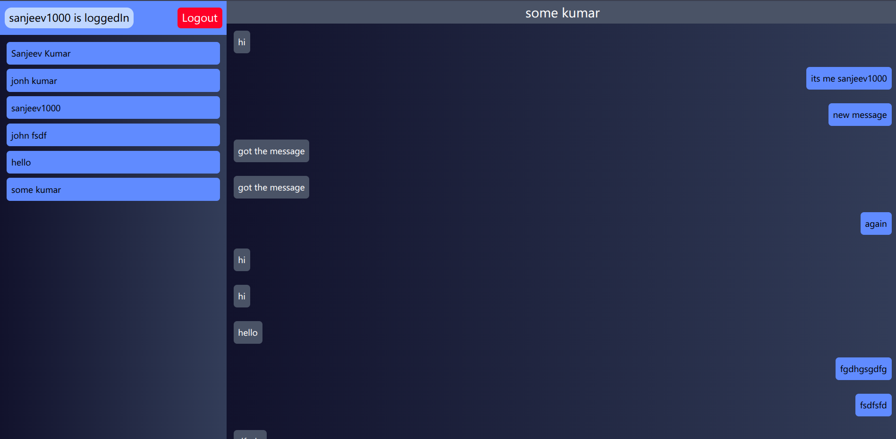
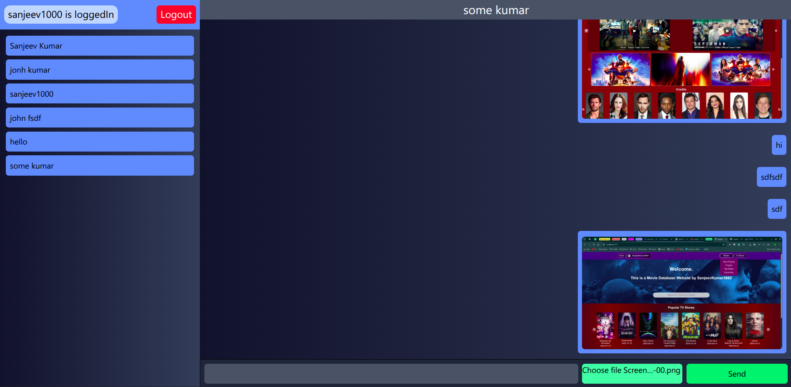
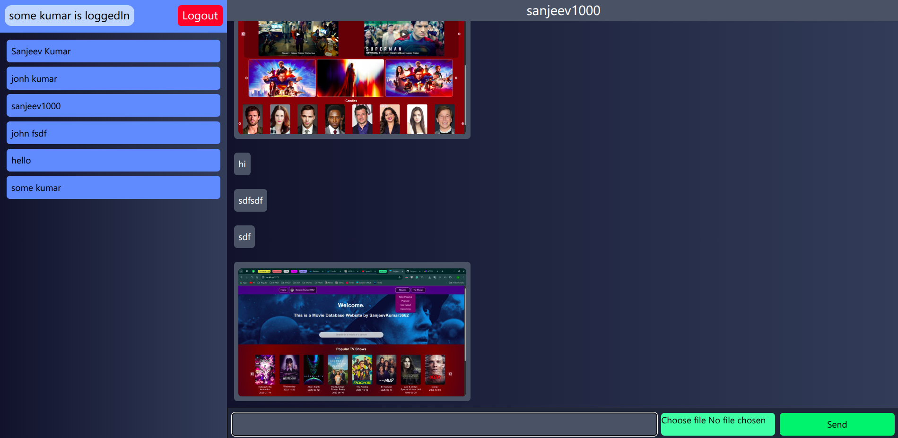

# 💬 Real-Time Chat App (MERN + Socket.IO)

A full-stack **real-time chat application** built using the **MERN stack**, featuring instant messaging with **Socket.IO**, image sharing via **Cloudinary**, authentication, and a modern React UI.

---

## 🚀 Features

- Real-time messaging with Socket.IO
- User authentication (JWT + cookies)
- Send text **and image messages**
- Image upload using Cloudinary
- Private chat rooms (user-based rooms)
- Chat history persistence with MongoDB

- ⬇️ Auto-scroll to latest message
- 🧠 Global state management using Zustand
- 🎨 Modern UI with Tailwind CSS

---

## 🛠️ Tech Stack

### Frontend

- React (Vite)
- Zustand (state management)
- Axios
- Tailwind CSS
- Socket.IO Client

### Backend

- Node.js
- Express.js
- MongoDB + Mongoose
- Socket.IO
- Cloudinary
- JWT Authentication
- dotenv

---

## Images





---

### Project Structure

<pre>chat_app_mern/
├── backend/
│ ├── src/
│ │ ├── controllers/
│ │ ├── routes/
│ │ ├── middleware/
│ │ ├── utils/
│ │ ├── db/
│ │ └── index.js
│ └── .env
│
├── frontend/
│ ├── src/
│ │ ├── components/
│ │ ├── store/
│ │ ├── lib/
│ │ └── pages/
│ └── vite.config.js
</pre>

---

## ⚙️ Environment Variables

Create a `.env` file in the **backend** folder:

```env
PORT=3000
MONGODB_URI=your_mongodb_connection_string
JWT_SECRET=your_jwt_secret

CLOUDINARY_CLOUD_NAME=your_cloud_name
CLOUDINARY_API_KEY=your_api_key
CLOUDINARY_API_SECRET=your_api_secret
```

### Image Messaging

Images are converted to base64 on the client

Uploaded to Cloudinary on the server

Stored as image URLs in MongoDB

Rendered instantly in chat messages

### Key Learnings

Handling Socket.IO with React 19 & Strict Mode

Preventing duplicate socket listeners

Managing real-time state with Zustand

Correct environment variable loading in ES Modules

Handling large payloads & image uploads

Structuring a scalable MERN backend

###　 Future Improvements

- Typing indicators

- Online / offline status

- Read receipts

- Message reactions

- Group chats

- Direct Cloudinary upload from frontend

###　 Contributing

Contributions, issues, and feature requests are welcome!
Feel free to fork the repo and submit a PR.

### License

This project is open-source and available under the MIT License.

If you like this project, give it a star!

---
